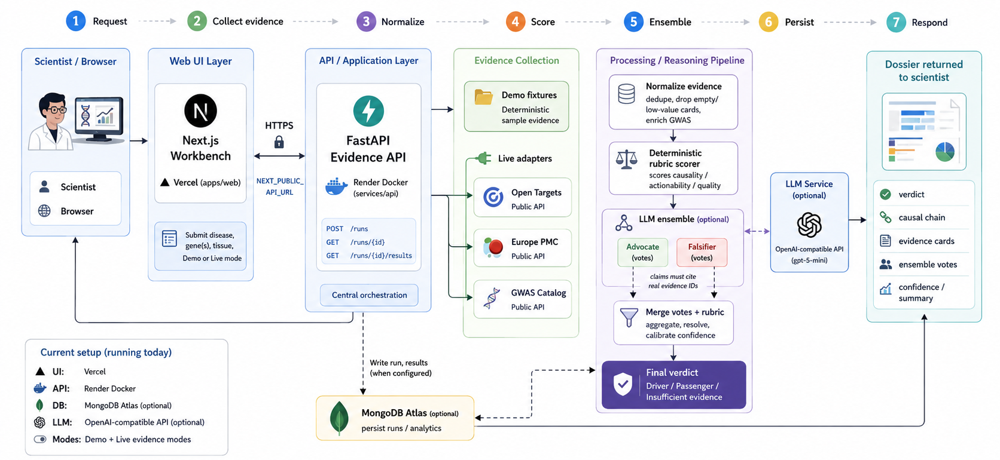
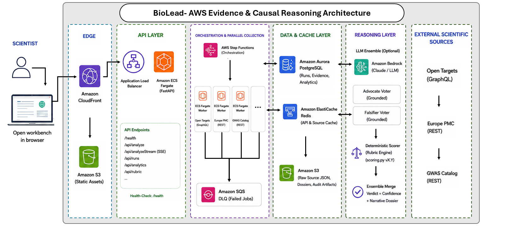

# BioLead Evidence Workbench

BioLead is a scientific reasoning workbench that separates **driver (carrier)** genes from **passenger** genes in dermatology target triage. It is a **decision product**, not a literature chatbot: a deterministic evidence rubric scores candidates; optional LLM voters (advocate / falsifier) argue over grounded evidence IDs; disagreements or weak pillars produce **Insufficient evidence**.

**Research use only** — not clinical decision support.

## Try it online

Live demo: https://biolead-ai-agent-eight.vercel.app

Use **Demo** mode for the seeded IL4R / S100A8 / FLG comparison. The first request after idle may take ~30–60s while the free API host wakes up.

**LLM / ensemble (optional):** The deterministic rubric always runs. To enable GPT-based advocate + falsifier votes, set `LLM_API_KEY` (and optionally `LLM_MODEL`, e.g. `gpt-5-mini`) on the API host and set `ENSEMBLE_REQUIRED=true`. Without a key, the workbench still works; ensemble LLM voters are simply unavailable.

---

## Key pieces

| Area | Where |
| --- | --- |
| Reasoning design | [`docs/reasoning-rubric.md`](docs/reasoning-rubric.md) |
| Deterministic scoring | [`services/api/app/scoring.py`](services/api/app/scoring.py) |
| Hybrid ensemble (rubric + advocate + falsifier) | [`services/api/app/ensemble.py`](services/api/app/ensemble.py), [`services/api/app/reasoning.py`](services/api/app/reasoning.py) |
| Live evidence adapters (Open Targets, Europe PMC, GWAS Catalog) | [`services/api/app/adapters.py`](services/api/app/adapters.py) |
| Seeded demo fixtures | [`services/api/app/fixtures.py`](services/api/app/fixtures.py) |
| Workbench UI | [`apps/web/src/app/page.tsx`](apps/web/src/app/page.tsx) |
| Demo walkthrough | [`docs/demo-script.md`](docs/demo-script.md) |

### Seeded demo outcomes (atopic dermatitis)

| Gene | Expected verdict |
| --- | --- |
| **IL4R** | Driver |
| **S100A8** | Passenger |
| **FLG** | Insufficient evidence |

---

## Quick start (recommended: Docker Compose)

Requires Docker Desktop.

```bash
# From repo root
cp .env.example .env
# Optional: set LLM_API_KEY in .env for live ensemble narratives

docker compose up --build
```

Open **http://localhost:3000**

- Leave mode on **Demo** for the reproducible three-gene comparison.
- Switch to **Live** for real Open Targets / Europe PMC / GWAS Catalog calls (needs network; LLM key optional but recommended when `ENSEMBLE_REQUIRED=true`).

---

## Local start (without Docker)

### 1. API

```bash
cd services/api
python -m venv .venv

# Windows
.\.venv\Scripts\activate
# macOS / Linux
# source .venv/bin/activate

pip install -r requirements.txt
uvicorn app.main:app --reload --port 8000
```

Health check: http://localhost:8000/health

### 2. Web

```bash
cd apps/web
npm install
set NEXT_PUBLIC_API_URL=http://localhost:8000   # Windows cmd
# export NEXT_PUBLIC_API_URL=http://localhost:8000  # macOS/Linux

npm run dev
```

Open **http://localhost:3000**

### 3. Optional MongoDB

The API runs without MongoDB. To persist runs:

```bash
docker run -d -p 27017:27017 --name biolead-mongo mongo:7
```

```bash
# In .env
MONGODB_URI=mongodb://localhost:27017
MONGODB_DB=biolead
```

---

## Environment variables

Copy `.env.example` → `.env`. **Never commit `.env`.**

| Variable | Required? | Purpose |
| --- | --- | --- |
| `NEXT_PUBLIC_API_URL` | Yes (web) | API base URL (`http://localhost:8000` locally) |
| `CORS_ORIGINS` | Yes (API) | Allowed web origins |
| `LLM_API_KEY` | Optional* | OpenAI-compatible key for advocate/falsifier |
| `LLM_BASE_URL` | Optional | Default `https://api.openai.com/v1` |
| `LLM_MODEL` | Optional | Default `gpt-5-mini` |
| `ENSEMBLE_REQUIRED` | Optional | `true` = abstain if LLM voters unavailable |
| `MONGODB_URI` / `MONGODB_DB` | Optional | Persist analysis runs |
| `NEXT_PUBLIC_SUPABASE_*` / `SUPABASE_*` | Optional | Sign-in; guest mode works without auth |
| `AUTH_REQUIRED` | Optional | Default `false` — analysis works without sign-in |

\*With `ENSEMBLE_REQUIRED=true` and no LLM key, the agent abstains rather than silently falling back to rubric-only.

---

## Tests

```bash
cd services/api
python -m pytest -q

cd apps/web
npx playwright install chromium
npm run test:e2e
```

---

## Repository layout

```
apps/web/                 Next.js workbench UI
services/api/             FastAPI evidence + reasoning service
  app/                    scoring, ensemble, adapters, fixtures
  prompts/                advocate / falsifier prompts
  tests/                  unit tests
docs/                     reasoning rubric, demo script, architecture notes
fixtures/                 benchmark / ground-truth helpers
infra/                    minimal AWS CDK sketch (optional)
docker-compose.yml        local full stack (web + api + mongo)
```

---

## How the agent decides

1. **Collect** structured evidence (demo fixtures or live public APIs).
2. **Normalize** — drop empty/duplicate/low-value cards; enrich GWAS with rsID, trait, p-value.
3. **Score** with a versioned deterministic rubric (weights favor MR, colocalization, clinical, perturbation over expression/literature).
4. **Ensemble** — LLM advocate and falsifier vote; claims must cite real evidence IDs.
5. **Verdict** — Driver / Passenger / Insufficient; exportable dossier with citations.

Full design: [`docs/reasoning-rubric.md`](docs/reasoning-rubric.md).

---

## System workflow

End-to-end path of a BioLead analysis in the current deployment:

<p align="center">
  
</p>

| Stage | What happens |
| --- | --- |
| **Request** | Scientist submits disease, gene(s), tissue, and Demo/Live mode in the Next.js workbench (Vercel). |
| **Collect** | FastAPI pulls Demo fixtures or Live evidence from Open Targets, Europe PMC, and GWAS Catalog. |
| **Normalize → Score** | Evidence is deduplicated and scored by the deterministic causal rubric. |
| **Ensemble** | Optional advocate ∥ falsifier LLM votes (grounded to evidence IDs) merge with the rubric. |
| **Persist / Respond** | Runs may be stored in MongoDB Atlas; the UI returns the dossier (verdict, causal chain, evidence). |

Hosts today: **Vercel** (UI) · **Render** (API) · **MongoDB Atlas** (optional) · **OpenAI-compatible LLM** (optional).

---

## Target AWS architecture

How the same system maps to a production AWS footprint (ALB / ECS / Step Functions / Aurora / Redis / Bedrock). This is the scale-out design; the running prototype is the workflow above.

<p align="center">
  
</p>

Notes: [`docs/aws-architecture.md`](docs/aws-architecture.md) · [`infra/`](infra/).

---

## License / use

Research prototype. Public scientific APIs remain under their own terms. Not for clinical use.
