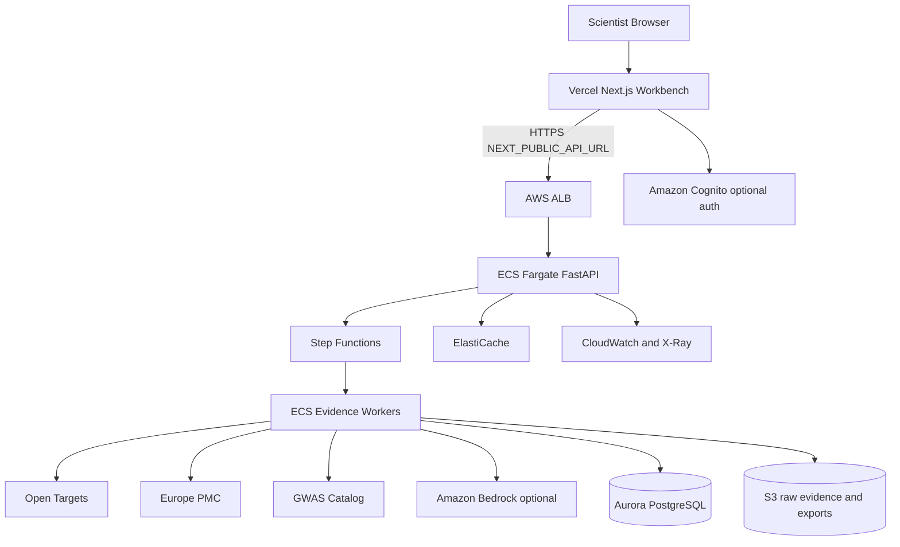

# BioLead production target: Vercel + AWS

> Current prototype: Vercel frontend + Render API + Mongo Atlas, with optional
> Redis and OpenAI-compatible LLM voters. The AWS services below are the
> scale-out target architecture; they are not all implemented or deployed today.

## Recommended split
- **Vercel** hosts the Next.js workbench (`apps/web`)
- **AWS** hosts the FastAPI evidence API and production workflow (`services/api`)

This keeps the UI fast and global while putting long-running scientific collection, caching, and provenance on AWS.

## Runtime map



## AWS services
| Layer | Service | Role |
| --- | --- | --- |
| Edge / auth | Cognito (optional) | Scientist identity |
| API | ALB + ECS Fargate | FastAPI `/api/analyze`, `/api/demo`, SSE |
| Orchestration | Step Functions + ECS workers | Evidence collection fan-out |
| LLM | Bedrock | Critic / synthesis (optional) |
| Data | Aurora PostgreSQL (+ pgvector later) | Normalized evidence + runs |
| Object store | S3 | Raw API payloads, dossier exports |
| Cache | ElastiCache | Source TTL cache |
| Ops | CloudWatch, X-Ray, SQS DLQ | Observability and failure isolation |

## Vercel configuration
1. Import the repo and set **Root Directory** to `apps/web`.
2. Set environment variable:
   - `NEXT_PUBLIC_API_URL=https://api.your-domain.com`
3. Deploy. The offline demo still renders if the API is unreachable.

## API environment variables
```bash
CORS_ORIGINS=https://your-app.vercel.app
LLM_API_KEY=...                 # optional
LLM_BASE_URL=https://api.openai.com/v1
LLM_MODEL=gpt-5-mini
```

For Bedrock in production, swap the narrative provider to a Bedrock client while keeping the deterministic scorer unchanged.

## Minimal first deploy path
1. Local Docker Compose for demo.
2. Deploy API container to ECS Fargate behind an ALB.
3. Deploy web to Vercel with `NEXT_PUBLIC_API_URL` pointing at the ALB.
4. Add Cognito / Step Functions / Aurora once the core loop is stable.

## Why not API-on-Vercel
Evidence collection is multi-source, latency-variable, and needs durable provenance storage. ECS + Step Functions match that workload better than short-lived serverless request handlers.
