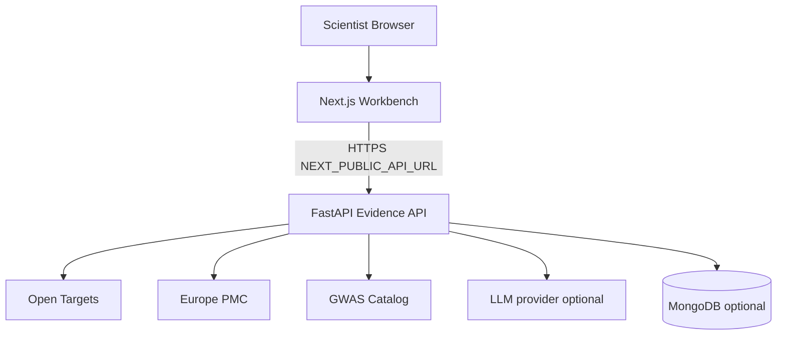
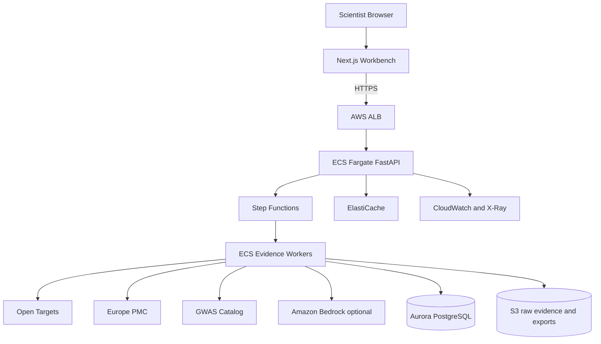

# BioLead Deployment Architecture

## Runtime map (local / prototype)



## Production-oriented AWS sketch



## AWS services

| Layer | Service | Role |
| --- | --- | --- |
| API | ALB + ECS Fargate | FastAPI `/api/analyze`, `/api/demo`, SSE |
| Orchestration | Step Functions + ECS workers | Evidence collection fan-out |
| LLM | Bedrock (optional) | Narrative voters |
| Data | Aurora PostgreSQL | Normalized evidence + runs |
| Object store | S3 | Raw API payloads, dossier exports |
| Cache | ElastiCache | Source TTL cache |
| Ops | CloudWatch, X-Ray, SQS DLQ | Observability |

## API environment variables

```bash
CORS_ORIGINS=http://localhost:3000
LLM_API_KEY=
LLM_BASE_URL=https://api.openai.com/v1
LLM_MODEL=gpt-5-mini
ENSEMBLE_REQUIRED=true
MONGODB_URI=mongodb://localhost:27017
MONGODB_DB=biolead
```

## Minimal path

1. Local Docker Compose for demo and review.
2. Deploy API container to ECS Fargate behind an ALB.
3. Point the workbench `NEXT_PUBLIC_API_URL` at the ALB.
4. Add Step Functions / Aurora / ElastiCache once the core loop is stable.

Add your Excalidraw / flowchart export beside this file when ready.
